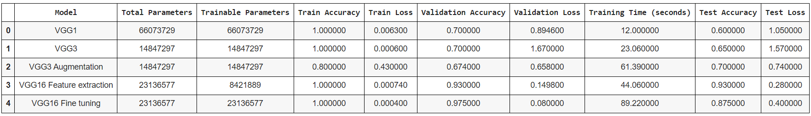

# CNN (VGG - Visual Geometry Group) 

## Below table shows parameters in different CNN models

## Tensorboard implementation on VGG-3 to plot graphs
1. Train accuracy Vs iterations

2. Train loss Vs iterations

3. Test accuracy Vs iterations

